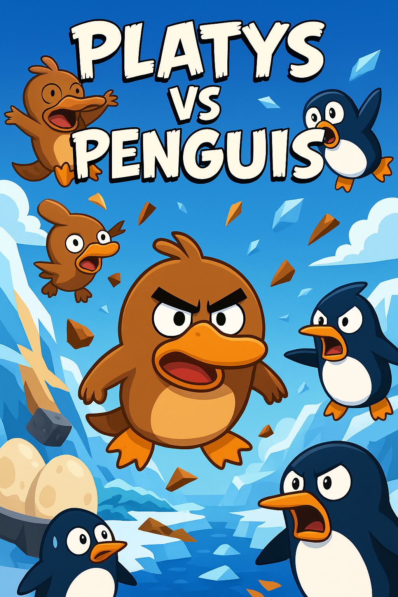
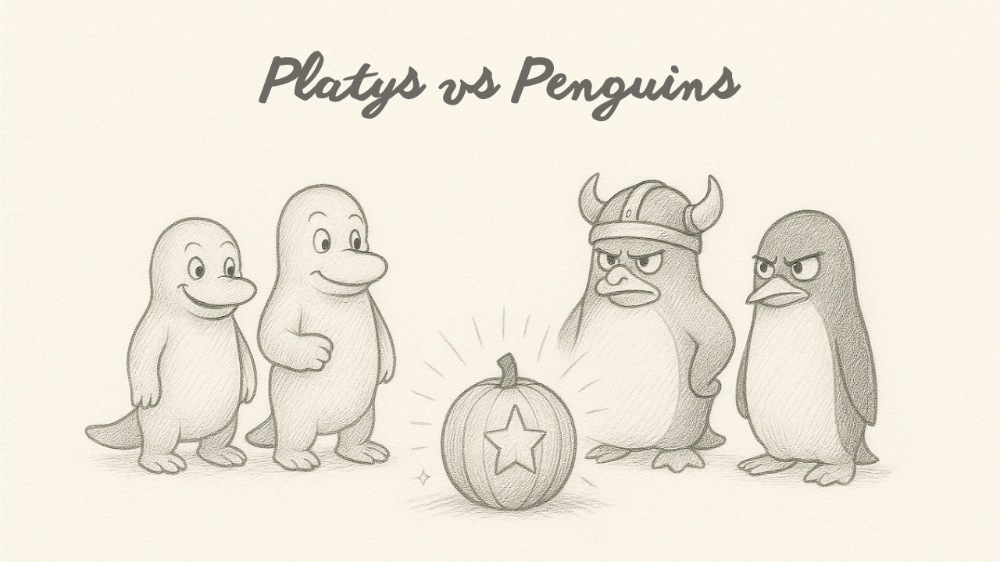
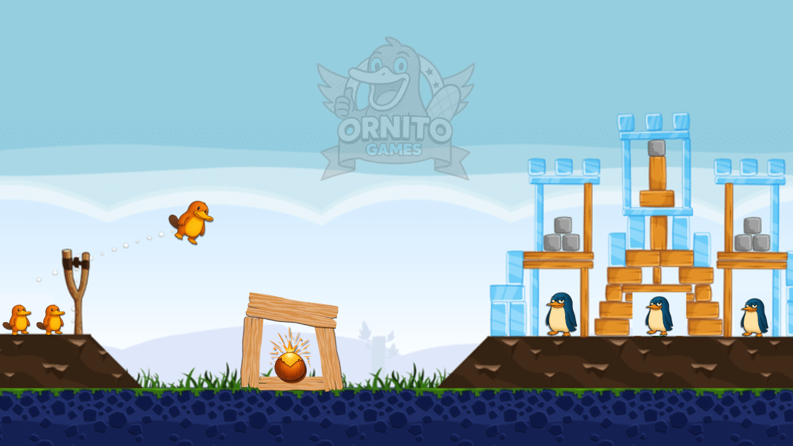
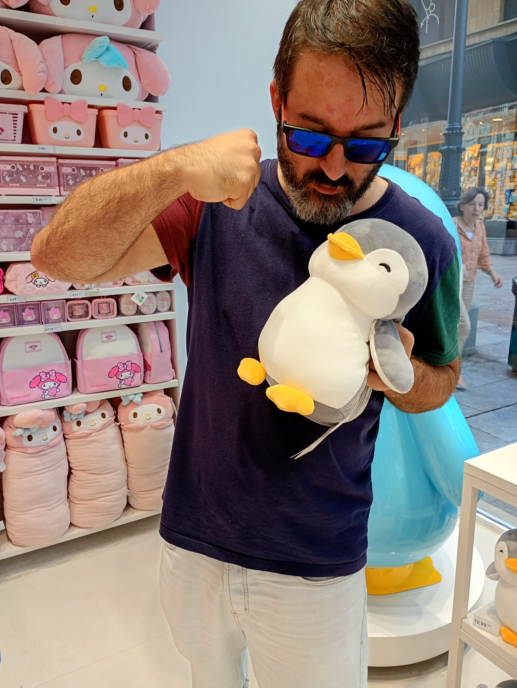

# 🦦​Platys vs Penguins🐧​

## ✏️​ Boceto Base del Juego: Platys vs Penguins 

El **Game Design Document (GDD)** es el documento principal y esencial que recopila toda la información relevante sobre un videojuego, sirviendo como hoja de ruta que establece los objetivos y define el concepto para el equipo de desarrollo. Este apartado es el primer boceto para entender cómo vamos a desarrollar el proyecto.

  

---

### I. 📝​ Introducción y Concepto

#### Título
**Platys vs Penguins** (Ornitorrincos contra Pingüinos).

#### Género y Perspectiva
El juego se inspira en la mecánica de *Angry Birds*, centrándose en la física y la destrucción de estructuras. La perspectiva será **2D lateral**.

#### Inspiración y Componente Diferenciador
Mientras que *Angry Birds* presenta un enemigo pasivo que solo espera la destrucción de estructuras, **Platys vs Penguins** se diferencia al plantear una batalla activa y dinámica entre dos bandos (Ornitorrincos vs. Pingüinos). El juego utiliza un sistema de turnos alternos y la **IA enemiga ataca y presiona constantemente**, añadiendo tensión estratégica.

#### Pilares del Diseño (Sensaciones/Metáfora)
El juego tiene una tensión entre facciones a través de su metáfora principal:

- **Ornitorrincos**: Representan la diversidad, la creatividad y la autenticidad.  
- **Pingüinos**: Representan la uniformidad, la imposición y la frialdad.  
- **Coco de la Sabiduría**: Representa el poder de la imaginación, algo que siempre merece la pena defender. (Ej: poción mágica Astérix y Obélix)

---

### II. 🏝️ Historia Base (Lore)

#### Sinopsis y Esencia
En la tranquila **Isla Ornitopía**, los ornitorrincos viven en armonía gracias al **Coco de la Sabiduría**, un fruto sagrado que irradia energía creativa.  

Los pingüinos, provenientes del **Abismo Gélido**, son fríos y ambiciosos, y su objetivo es robar el Coco para extinguir la chispa creativa de los ornitorrincos.  

La misión del jugador es **defender este Coco de los ataques invasores**.  

La historia será progresiva, mostrando cómo los pingüinos mejoran su organización para el robo del Coco.

---

### III. ​⚔️​ Personajes y Facciones

El juego cuenta con dos bandos asimétricos, cada uno con características y objetivos distintos.

#### 1. Ornitorrincos (Los héroes / Jugador)
Son criaturas versátiles, adaptables y auténticas: inventores, artistas y exploradores que encuentran en el Coco su inspiración para evolucionar.

- **Rasgos**:  
  - Versatilidad (usan distintos recursos como madera, agua, fuego, energía)  
  - Adaptación (cambian de estrategia según el terreno)  
  - Autenticidad (cada uno tiene un poder único)

- **Tipos de Ornitorrinco**:  
  - **Platy Bumerán**: Se lanza y regresa, golpeando dos veces.  
  - **Platy Constructor**: Lanza materiales que forman pequeñas defensas al chocar.  
  - **Platy Explosivo**: Libera burbujas de energía al impactar.  
  - **Platy Líquido**: Se divide en varias gotas y ataca múltiples puntos.  

#### 2. Pingüinos (Los villanos / IA enemiga)
Son astutos, fríos y ambiciosos. Se distinguen por su armamento, a pesar de ser muy parecidos entre sí.

- **Rasgos**:  
  - Ambición (quieren el Coco cueste lo que cueste)  
  - Frialdad (calculadores, planean en bandada)  
  - Uniformidad  

- **Tipos de Pingüinos**:  
  - **Pingüino Soldado**: Unidad básica, rompe estructuras.  
  - **Pingüino Escudo**: Resistente, difícil de derrotar.  
  - **Pingüino Catapulta**: Lanza bolas de nieve gigantes.  
  - **Pingüino General**: El jefe de nivel, muy astuto con habilidades especiales.  

---

### IV. 🏹​ Mecánicas de Juego y Flujo (Jugabilidad)

#### Flujo del Escenario General
- **Lado Izquierdo**: Ornitorrincos, controlados por el jugador.  
- **Centro**: El Coco de la Sabiduría (el objetivo a proteger).  
- **Lado Derecho**: Pingüinos, controlados por la IA enemiga.  

#### Bucle de Juego Principal (Core Loop)
La dinámica principal se basa en **turnos alternos**:

1. **Turno 1 (Jugador - Ornitorrincos)**  
   El jugador selecciona un ornitorrinco y lo lanza con un tirachinas o catapulta de madera tropical para dañar a los pingüinos o reforzar las defensas del Coco.  

2. **Turno 2 (IA - Pingüinos)**  
   La IA responde lanzando proyectiles de hielo, bolas de nieve o catapultas improvisadas hacia el Coco o contra los ornitorrincos.  

3. **Rondas Sucesivas**  
   Los ataques se alternan hasta que se cumpla la condición de victoria o derrota.

#### Elementos Estratégicos
- **Mecánica de Lanzamiento**: Selección de un ornitorrinco con habilidades especiales y lanzamiento para impactar estructuras de hielo y metal.  
- **El Coco de la Sabiduría**:  
  - Es el objetivo central.  
  - Reacciona al entorno: libera ondas de energía que empujan a ambos bandos si recibe impactos fuertes.  
  - Puede recargar habilidades de los ornitorrincos si se activa de forma controlada.  
- **Estrategia Dual**:  
  - Ornitorrincos: atacar las estructuras enemigas y defender el Coco.  
  - Pingüinos: romper defensas y alcanzar el objetivo central.  

#### Condiciones de Victoria y Derrota
- **Victoria (Jugador)**: Todos los pingüinos son derrotados → Avance al siguiente escenario.  
- **Derrota (Jugador)**: Los pingüinos logran robar el Coco de la Sabiduría → Fin de la partida.  

---

### V. ⌨️​ Niveles y Progresión

El juego se divide en **Capítulos** que progresan en dificultad y complejidad de las estructuras.

| Capítulo       | Título del Escenario                  | Temática y Estructuras                             | Enemigos Introducidos   |
|----------------|---------------------------------------|---------------------------------------------------|--------------------------|
| **Capítulo 1** | Playa Soleada / Playa del Amanecer    | Primeros combates, estructuras simples de madera y hielo. | Pingüino Soldado |
| **Capítulo 2** | Selva Espesa / Selva del Río Azul     | Obstáculos naturales y trampas. Estructuras de hielo con proyectiles de hielo. | Pingüino Escudo |
| **Capítulo 3** | Volcán Dormido / Volcán Ardiente      | Introducción del fuego y estructuras volcánicas. Escenario con erupciones que alteran la física. | Pingüino Catapulta |
| **Capítulo Final** | Fortaleza de Hielo / Glacial      | Batalla final contra el General Pingüino en su castillo helado. | Pingüino General y todos los tipos |

   
  Cada capítulo culmina con un <b>jefe</b> que presenta un reto especial.  
    
  <i>Foto del autor del proyecto defendiéndose de un pingüino</i> 

Tu **misión** es no permitir que los pingüinos te roben tu Coco de la Sabiduría, es tu conocimiento, es tu creatividad y la debes defender a toda costa, sin él perderás todo.

---

